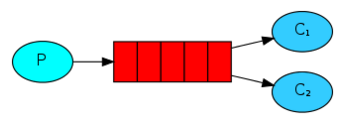
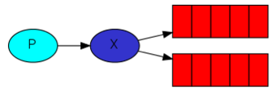
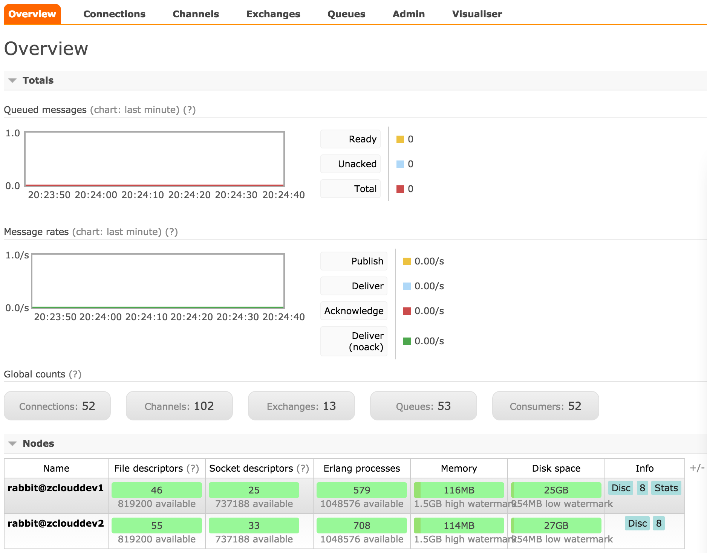
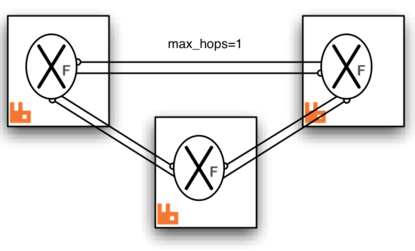
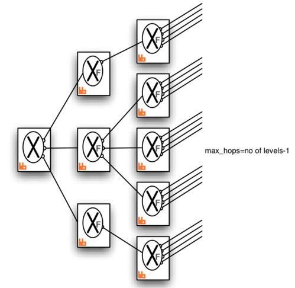

  

# RabbitMQ使用心得

由于之前做的项目中需要在多个节点之间**可靠地**通信，所以废弃了之前使用的Redis pub/sub（因为集群有单点问题，且有诸多限制），改用了RabbitMQ。  
使用期间得到不少收获，也踩了不少坑，所以在此分享下心得。（简单了解下RabbitMQ? [点这里](#other)）

### 怎么保证可靠性的？

RabbitMQ提供了几种特性，牺牲了一点性能代价，提供了可靠性的保证。

*	持久化  
当RabbitMQ退出时，默认会将消息和队列都清除，所以需要在**第一次**声明队列和发送消息时指定其持久化属性为true，这样RabbitMQ会将队列、消息和状态存到RabbitMQ本地的数据库，重启后会恢复。  
java:  

		durable=true   
		channel.queueDeclare("task_queue", durable, false, false, null); // 队列  
		channel.basicPublish("", "task_queue",
            MessageProperties.PERSISTENT_TEXT_PLAIN,
            message.getBytes()); // 消息

注：当声明的队列已经存在时，尝试重新定义它的durable是不生效的。

*	接收应答  
客户端接收消息的模式默认是自动应答，但是通过设置autoAck为false可以让客户端主动应答消息。当客户端拒绝此消息或者未应答便断开连接时，就会使得此消息重新入队（在版本2.7.0以前是到重新加入到队尾，2.7.0及以后是保留消息在队列中的原来位置）。  
java: 

		autoAck = false;
		requeue = true;
		channel.basicConsume(queue, autoAck, callback);
		channel.basicAck();//应答
		channel.basicReject(deliveryTag, requeue); // 拒绝
		channel.basicRecover(requeue); // 恢复

*	发送确认  
默认情况下，发送端不关注发出去的消息是否被消费掉了。可设置channel为confirm模式，所有发送的消息都会被确认一次，用户可以自行根据server发回的确认消息查看状态。详细介绍见：[confirms](http://www.rabbitmq.com/confirms.html)  
java:  

		channel.confirmSelect(); // 进入confirm模式
		// do publish messages... 每条消息都会被编号，从1开始
		channel.getNextPublishSeqNo() // 查看下一条要发送的消息的序号
		channel.waitForConfirms(); // 等待所有消息发送并确认 

*	事务：和confirm模式不能同时使用，而且会带来大量的多余开销，导致吞吐量下降很多，故而不推荐。  
java:  

		channel.txSelect();
		try {
			// do something...
			channel.txCommit();
		} catch (e){
			channel.txRollback();
		}

*	<a name="ha" />  消息队列的高可用（主备模式）  
相比于路由和绑定，可以视为是共享于所有的节点的，消息队列默认只存在于第一次声明它的节点上，这样一旦这个节点挂了，这个队列中未处理的消息就没有了。
 幸好，RabbitMQ提供了将它备份到其他节点的机制，任何时候都有一个master负责处理请求，其他slaves负责备份，当master挂掉，会将最早创建的那个slave提升为master。  
命令：  
`rabbitmqctl set_policy ha-all "^ha\." '{"ha-mode":"all"}'`：设置所有以'ha'开头的queue在所有节点上拥有备份。[详细语法点这里](http://www.rabbitmq.com/ha.html)；
也可以在界面上配置。  

注：由于exclusive类型的队列会在client和server连接断开时被删掉，所以对它设置持久化属性和备份都是没有意义的。

*	顺序保证  
直接上图好了：  
  

### 一些需要注意的地方

*	集群配置：  
一个集群中多个节点共享一份.erlang.cookie文件；若是没有启用RABBITMQ_USE_LONGNAME，需要在每个节点的hosts文件中指定其他节点的地址，不然会找不到其他集群中的节点。

*	<a name="cluster_partion"  /> 脑裂（网络分区）：  
RabbitMQ集群对于网络分区的处理和忍受能力不太好，推荐使用[federation](#federation)或者shovel插件去解决。  
 但是，情况已经发生了，怎么去解决呢？放心，还是有办法恢复的。  
 当网络断断续续时，会使得节点之间的通信断掉，进而造成集群被分隔开的情况。  
 这样，每个小集群之后便只处理各自本地的连接和消息，从而导致数据不同步。当重新恢复网络连接时，它们彼此都认为是对方挂了-_-||，便可以判断出有网络分区出现了。但是RabbitMQ默认是忽略掉不处理的，造成两个节点继续各自为政（路由，绑定关系，队列等可以独立地创建删除，甚至主备队列也会每一方拥有自己的master）。  
 可以更改配置使得连接恢复时，会根据配置自动恢复：  

	*	ignore：默认，不做任何处理
	*	pause-minority：断开连接时，判断当前节点是否属于少数派（节点数少于或者等于一半），如果是，则暂停直到恢复连接。
	*	{pause_if_all_down, [nodes], ignore | autoheal}：断开连接时，判断当前集群中节点是否有节点在nodes中，如果有，则继续运行，否则暂停直到恢复连接。这种策略下，当恢复连接时，可能会有多个分区存活，所以，最后一个参数决定它们怎么合并。
	*	autoheal：当恢复连接时，选择客户端连接数最多的节点状态为主，重启其他节点。

配置：[集群配置](#cluster)

*	多次ack  
客户端多次应答同一条消息，会使得该客户端收不到后续消息。

###	结合Docker使用
集群版本的实现：详见我自己写的一个例子[rabbitmq-server-cluster](https://github.com/dengyuankai272/rabbitmq-server-cluster)

### 消息队列中间件的比较  

*	RabbitMQ：  

	*	优点：支持很多协议如：AMQP，XMPP，STMP，STOMP；灵活的路由；成熟稳定的集群方案；负载均衡；数据持久化等。
	*	缺点：速度较慢；比较重量级，安装需要依赖Erlang环境。

*	Redis：

	*	优点：比较轻量级，易上手
	*	缺点：单点问题，功能单一

*	Kafka：  

	*	优点：高吞吐；分布式；快速持久化；负载均衡；轻量级
	*	缺点：极端情况下会丢消息

最后附一张网上截取的测试结果:  

  

更多性能参数见：[http://www.rabbitmq.com/blog/2012/04/25/rabbitmq-performance-measurements-part-2/](http://www.rabbitmq.com/blog/2012/04/25/rabbitmq-performance-measurements-part-2/)

如果有兴趣简单了解下RabbitMQ的简单介绍，可以继续往下看～

# <a name="other" /> 简介

## 几个重要的概念  

*	Virtual Host: 包含若干个Exchange和Queue，表示一个节点；
*	Exchange: 接受客户端发送的消息，并根据Binding将消息路由给服务器中的队列，Exchange分为direct, fanout, topic三种。
*	Binding: 连接Exchange和Queue，包含路由规则。
*	Queue: 消息队列，存储还未被消费的消息。
*	Message: Header+Body
*	Channel: 通道，执行AMQP的命令；一个连接可创建多个通道以节省资源。

## Client
RabbitMQ官方实现了很多热门语言的客户端，就不一一列举啦，以java为例，直接开始正题：  

*	建立连接：

		ConnectionFactory factory = new ConnectionFactory();
    	factory.setHost("localhost");
可以加上断开重试机制：

		factory.setAutomaticRecoveryEnabled(true);
		factory.setNetworkRecoveryInterval(10000);
创建连接和通道：

    	Connection connection = factory.newConnection();
    	Channel channel = connection.createChannel();

*	一对一：一个生产者，一个消费者  

  

生产者：  

	channel.queueDeclare(QUEUE_NAME, false, false, false, null);
	channel.basicPublish("", QUEUE_NAME, null, message.getBytes());

消费者：  

	Consumer consumer = new DefaultConsumer(channel) {
      @Override
      public void handleDelivery(String consumerTag, Envelope envelope, AMQP.BasicProperties properties, byte[] body)
          throws IOException {
        String message = new String(body, "UTF-8");
        System.out.println(" [x] Received '" + message + "'");
      }
    };
    channel.basicConsume(QUEUE_NAME, autoAck, consumer);

*	一对多：一个生产者，多个消费者  

  

代码同上，只不过会有多个消费者，消息会轮序发给各个消费者。  
如果设置了autoAck=false，那么可以实现公平分发（即对于某个特定的消费者，每次最多只发送指定条数的消息，直到其中一条消息应答后，再发送下一条）。需要在消费者中加上:  

	int prefetchCount = 1;
	channel.basicQos(prefetchCount);
其他同上。

*	广播  

  

生产者：  

	channel.exchangeDeclare(EXCHANGE_NAME, "fanout");
	String queueName = channel.queueDeclare().getQueue();
    channel.queueBind(queueName, EXCHANGE_NAME, "");
    channel.basicPublish(EXCHANGE_NAME, "", null, message.getBytes());

消费者同上。

*	Routing: 指定路由规则  

  

生产者：  

	String queueName = channel.queueDeclare().getQueue();
	channel.queueBind(queueName, EXCHANGE_NAME, routingKey);
	channel.basicPublish(EXCHANGE_NAME, routingKey, null, message.getBytes());
消费者同上。  

*	Topics: 支持通配符的Routing  

  

	*可以表示一个单词
	#可以表示一个或多个单词

生产者：  

	channel.exchangeDeclare(EXCHANGE_NAME, "topic");
	String queueName = channel.queueDeclare().getQueue();
	channel.queueBind(queueName, EXCHANGE_NAME, bindingKey);
消费者同上。  

*	RPC  

  

其实就是一对一模式的一种用法：  
首先，客户端发送一条消息到服务端声明的队列，消息属性中包含reply_to和correlation_id  

	- reply_to 是客户端创建的消息的队列，用来接收远程调用结果
	- correlation_id 是消息的标识，服务端回应的消息属性中会带上以便知道是哪条消息的结果。  

然后，服务端接收到消息，处理，并返回一条结果到reply_to队列中，  

最终，客户端接收到返回消息，继续向下处理。  

## Server
支持各大主流操作系统，这里以Unix为例介绍下常用配置和命令：

### 安装
由于RabbitMQ是依赖于Erlang的，所以得首先安装最近版本的Erlang。

单点的安装比较简单，下载解压即可。[下载地址](http://www.rabbitmq.com/download.html)  

*	配置：（一般的，用默认的即可。）  
	*	$RABBITMQ_HOME/etc/rabbitmq/rabbitmq-env.conf: 环境变量默认配置（也可在启动脚本中设置，且以启动命令中的配置为准）。常用的有：
		*	RABBITMQ_NODENAME：节点名称，默认是rabbit@$HOSTNAME。
		*	RABBITMQ_NODE_PORT：协议端口号，默认5672。
		*	RABBITMQ_SERVER_START_ARGS：覆盖rabbitmq.config中的一些配置。

	*	$RABBITMQ_HOME/etc/rabbitmq/rabbitmq.config: 核心组件，插件，erlang服务等配置，常用的有：
		*	disk_free_limit：队列持久化等信息都是存到RabbitMQ本地的数据库中的，默认限制50000000（也就是最多只让它使用50M空间啦，不够可以上调，也支持空闲空间百分比的配置）。要是超标了，它就罢工了……
		*	vm_memory_high_watermark：内存使用，默认0.4（最多让它使用40%的内存，超标罢工）

注：若启动失败了，可以在启动日志中查看到具体的错误信息。

*	命令：
	*	`$RABBITMQ_HOME/sbin/rabbitmq-server`：启动脚本，会打印出配置文件，插件，集群等信息；加上-detached为后台启动；
	*	`/sbin/rabbitmqctl status`：查看启动状态
	*	`/sbin/rabbitmqctl add_user admin admin`：添加新用户admin，密码admin；默认只有一个guest用户，但只限本机访问。
	*	`/sbin/rabbitmqctl set_user_tags admin administrator`：将admin设置为管理员权限
	*	`/sbin/rabbitmqctl set_permissions -p / admin ".*" ".*" ".*"` 赋予admin所有权限
	*	`/sbin/rabbitmqctl stop`：关闭

### <a name="cluster"  /> 集群  

集群节点共享所有的状态和数据，如：用户、路由、绑定等信息（队列有点特殊，虽然从所有节点都可达，但是只存在于第一次声明它的那个节点上，解决方案：[消息队列的高可用](#ha)）；每个节点都可以接收连接，处理数据。  

集群节点有两种，disc：默认，信息存在本地数据库；ram：加入集群时，添加--ram参数，信息存在内存，可提高性能。

*	配置：（一般的，用默认的即可。）
	*	$RABBITMQ_HOME/etc/rabbitmq/rabbitmq-env.conf：
		*	RABBITMQ_USE_LONGNAME：默认false，(默认的，RABBITMQ_NODENAME中@后面的$HOSTNAME是主机名，所以需要集群中每个节点的hosts文件包含其他节点主机名到地址的映射。但是如果设置为true，就可以定义RABBITMQ_NODENAME中的$HOSTNAME为域名了）
		*	RABBITMQ_DIST_PORT：集群端口号，默认RABBITMQ_NODE_PORT + 20000
	*	$RABBITMQ_HOME/etc/rabbitmq/rabbitmq.config：
		*	cluster_nodes：设置后，在启动时会尝试自动连接加入的节点并组成集群。
		*	cluster_partition_handling：[网络分区的处理](#cluster_partion)。

更多详细的配置见：[配置](http://www.rabbitmq.com/configure.html)  

*	命令
	*	`rabbitmqctl stop_app`
	*	`rabbitmqctl join_cluster [--ram] nodename@hostname`：将当前节点加入到集群中；默认是以disc节点加入集群，加上--ram为ram节点。
	*	`rabbitmqctl start_app`
	*	`rabbitmqctl cluster_status`：查看集群状态

注：如果加入集群失败，可先查看

*	每个节点的$HOME/.erlang.cookie内容一致；
*	如果hostname是主机名，那么此hostname和地址的映射需要加入hosts文件中；
*	如果使用的是域名，那么需要设置RABBITMQ_USE_LONGNAME为true。

注：docker版集群的见：[rabbitmq-server-cluster](https://github.com/dengyuankai272/rabbitmq-server-cluster)

## 高级

### AMQP协议简介
RabbitMQ原生支持AMQP 0-9-1并扩展实现了了一些常用的功能：[AMQP 0-9-1](http://www.rabbitmq.com/amqp-0-9-1-reference.html)  

包含三层：  

*	模型层: 最高层，提供了客户端调用的命令，如：queue.declare,basic.ack,consume等。
*	会话层：将命令从客户端传递给服务器，再将服务器的应答传递给客户端，会话层为这个传递过程提供可靠性、同步机制和错误处理。
*	传输层：主要传输二进制数据流，提供帧的处理、信道复用、错误检测和数据表示。  

  

注：其他协议的支持见：[RabbitMQ支持的协议](http://www.rabbitmq.com/protocols.html)

### 常用插件

#### 管理界面（神器）
启动后，执行`rabbitmq-plugins enable rabbitmq_management`->
访问[http://localhost:15672](http://localhost:15672)->查看节点状态，队列信息等等，甚至可以动态配置消息队列的主备策略，如下图：  

  

#### <a name="federation"/> Federation  

启用Federation插件，使得不同集群的节点之间可以传递消息，从而模拟出类似集群的效果。这样可以有几点好处：  

*	松耦合：联合在一起的不同集群可以有各自的用户，权限等信息，无需一致；此外，这些集群的RabbitMQ和Erlang的版本可以不一致。
*	远程网络连接友好：由于通信是遵循AMQP协议的，故而对断断续续的网络连接容忍度高。
*	自定义：可以自主选择哪些组件启用federation。  

几个概念：   

*	Upstreams: 定义上游节点信息，如：  
`rabbitmqctl set_parameter federation-upstream my-upstream '{"uri":"amqp://server-name","expires":3600000}'` 定义一个my-upstream  
	*	uri是其上游节点的地址，多个upstream的节点无需在同一集群中。  
	*	expires表示断开连接3600000ms后其上游节点会缓存消息。

*	Upstream sets: 多个Upstream的集合；默认有个`all`，会将所有的Upstream加进去。

*	Policies: 定义哪些exchanges,queues关联到哪个Upstream或者Upstream set，如：  
`rabbitmqctl set_policy --apply-to exchanges federate-me "^amq\." '{"federation-upstream-set":"all"}'`  将此节点所有以amq.开头的exchange联合到上游节点的同名exchange。  

注：

*	由于下游节点的exchange可以继续作为其他节点的上游，故可设置成循环，广播等形式。
*	通过max_hops参数控制传递层数。 
*	模拟集群，可以将多个节点两两互连，并设置max_hops=1。  

  
  

`rabbitmq-plugins enable rabbitmq_federation`  
如果启用了管理界面，可以添加：  
`rabbitmq-plugins enable rabbitmq_federation_management`  
这样就可以在界面配置Upstream和Policy了。

注：如果在一个集群中使用federation，需要该集群每个节点都启用Federation插件

注：更多插件请见：[插件](http://www.rabbitmq.com/plugins.html)